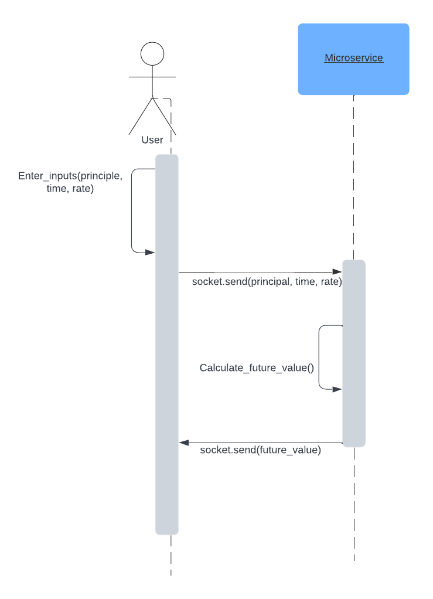

# CS361-microservice

To request data from the microservice, you will need to run the server.py program locally, then
initiate communication using python sockets. 

The below code is used in the client.py program as an example to communicate:

    s = socket.socket(socket.AF_INET, socket.SOCK_STREAM)
    s.connect((socket.gethostname(), 6060))

Data will need to be sent to the microservice using the socket to receive data in the format 
icome;time;rate: 

    data = income + ";" + time + ";" + rate
    s.send(data.encode())

After the data is sent to the microservice, the futture value calculation will run and send the 
result back to the client. To receive the result from the microservice, the below code needs to
be used:

    total = s.recv(4096)

## **UML SEQUENCE DIAGRAM**:

